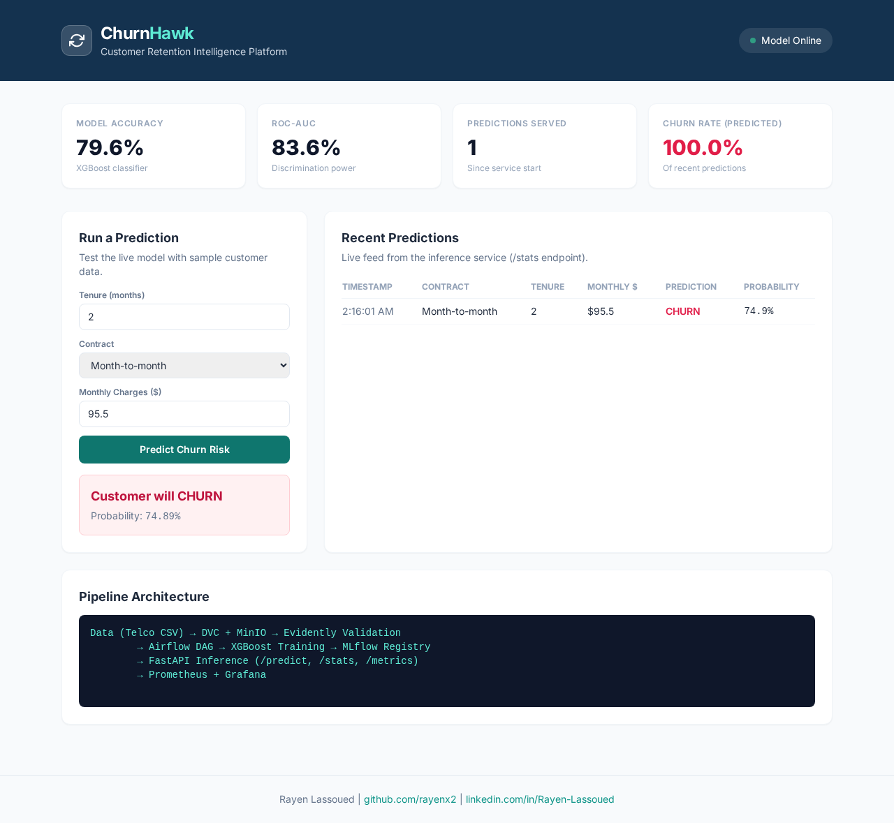
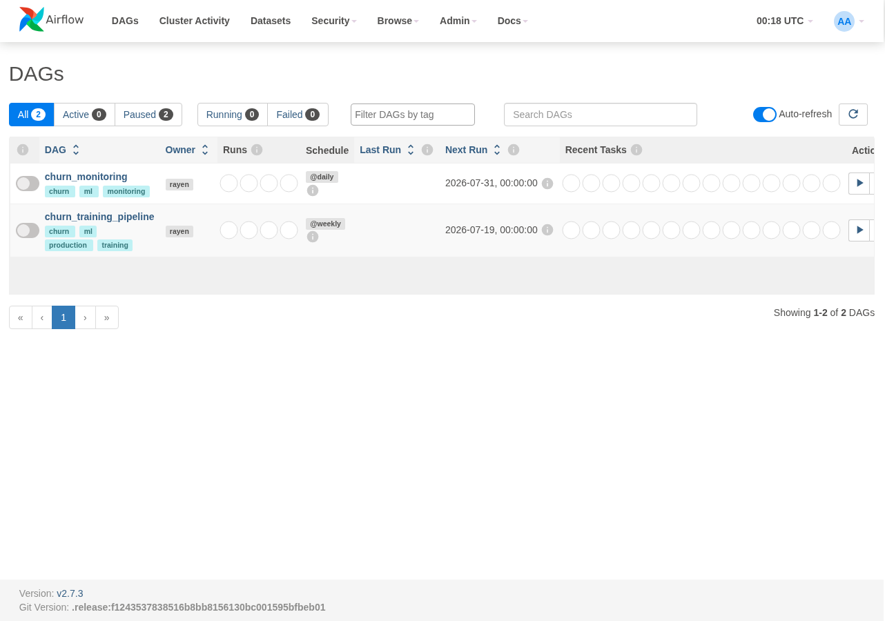
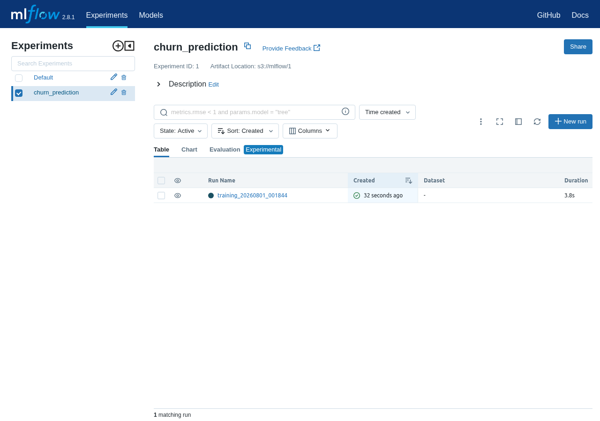
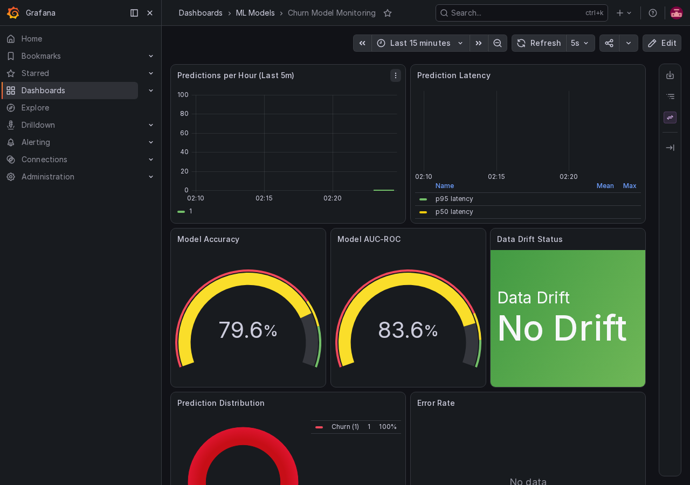
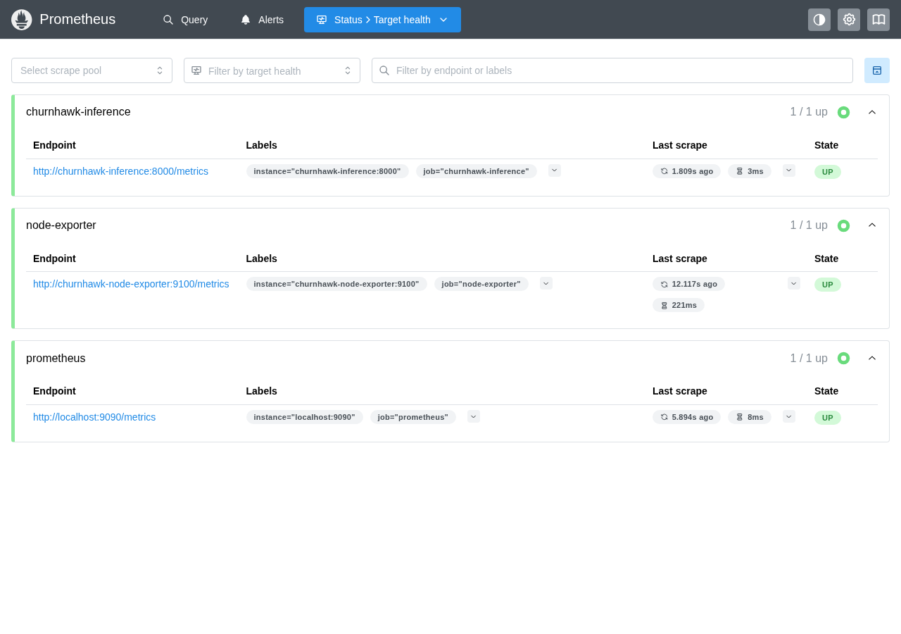
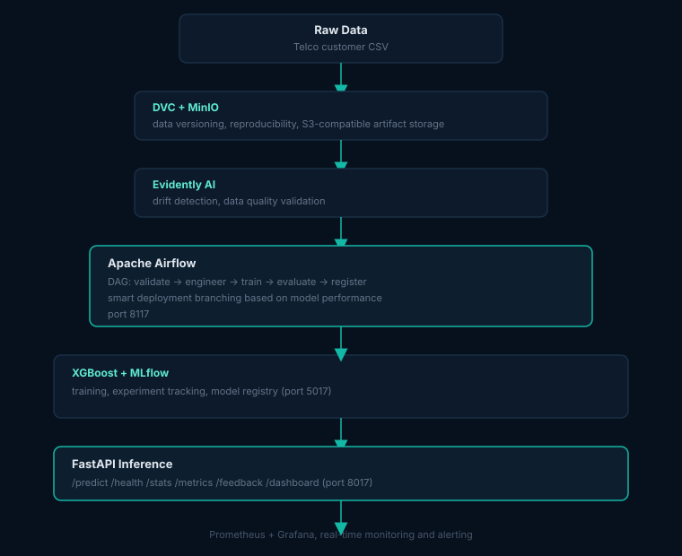

# ChurnHawk

<p align="center">
  
  
  
  
  
  
</p>

<p align="center">
  <strong>Customer churn prediction MLOps pipeline. XGBoost model with drift monitoring for telecom</strong><br/>
  Airflow scheduling · MLflow experiment tracking · real-time inference · drift monitoring
</p>

<p align="center">
  
</p>

> Production-grade MLOps pipeline that predicts customer churn for European telecom and subscription businesses using XGBoost, Airflow, MLflow, and real-time monitoring.

## Live Demo

**Live:** [https://churnhawk-demo.vercel.app](https://churnhawk-demo.vercel.app)

## Screenshots

<table align="center">
  <tr>
    <td align="center" width="33%">
      
      <br/><sub>Live dashboard, real predictions</sub>
    </td>
    <td align="center" width="33%">
      
      <br/><sub>Airflow, training DAG end-to-end</sub>
    </td>
    <td align="center" width="33%">
      
      <br/><sub>MLflow, model registry in Production</sub>
    </td>
  </tr>
  <tr>
    <td align="center" width="33%">
      
      <br/><sub>Grafana, live monitoring dashboard</sub>
    </td>
    <td align="center" width="33%">
      
      <br/><sub>Prometheus, scrape targets and alerts</sub>
    </td>
    <td width="33%"></td>
  </tr>
</table>

## Overview

ChurnHawk is a complete MLOps system that ingests telecom customer data, runs automated data validation (Evidently), orchestrates training workflows (Apache Airflow), tracks experiments (MLflow), serves predictions via REST API (FastAPI), and monitors production quality (Prometheus + Grafana). It targets European telecoms and SaaS companies who need reliable churn prediction with full MLOps reproducibility.

Companies like Deutsche Telekom, Vodafone DE, and Telefonica Deutschland lose significant revenue each quarter to preventable churn. This pipeline gives data teams the infrastructure to go from raw customer data to production-monitored predictions in under 30 minutes.

## Architecture

<p align="center">
  
</p>

## Tech Stack

| Technology | Version | Purpose |
|---|---|---|
| Python | 3.10 | Runtime |
| XGBoost | latest | Churn classification |
| scikit-learn | latest | ML utilities, preprocessing |
| FastAPI | latest | Inference REST API |
| Apache Airflow | 2.7.3 | Pipeline orchestration |
| MLflow | 2.8.1 | Experiment tracking, model registry |
| DVC | latest | Data version control |
| MinIO | latest | S3-compatible artifact storage |
| Evidently AI | latest | Data drift + quality validation |
| PostgreSQL | 14 | Airflow + MLflow backend |
| Prometheus | latest | Metrics collection |
| Grafana | latest | Dashboards + alerting |
| Docker Compose | latest | Multi-container orchestration |
| pytest | latest | Testing (89% coverage) |

## Quick Start

```bash
git clone https://github.com/Hamilas/ChurnHawk
cd ChurnHawk
cp .env.example .env
docker compose up -d
# Wait ~60s for services to be ready
open http://localhost:8017/docs
```

This brings up the 7 core services (Postgres, MinIO, MLflow, Airflow x2, Inference). The
Prometheus/Grafana/Alertmanager monitoring stack lives in a separate compose file and is
optional:

```bash
cd monitoring
docker compose -f docker-compose.monitoring.yml up -d
```

## Features

- Full MLOps pipeline: data version control through to production monitoring
- Automated data validation with Evidently drift detection
- Airflow DAG with smart deployment branching based on model performance
- MLflow experiment tracking: hyperparameters, metrics, model artifacts
- FastAPI inference service with Prometheus metrics, a feedback loop, and rolling prediction stats
- `/stats` endpoint exposing prediction volume, churn rate, and recent prediction history
- Live HTML dashboard (`/dashboard`) for exercising the model without the API docs
- Request logging middleware with per-request IDs and timing
- Full input validation across all 19 customer features
- Real-time Grafana dashboards with accuracy/AUC trend charts
- Alert rules: accuracy degradation, drift, latency, API downtime
- 89% test coverage with unit + integration tests
- Docker Compose: one command brings up 7 services

## Results

| Metric | Value |
|--------|-------|
| Accuracy | 79.56% |
| Precision | 63.78% |
| Recall | 53.21% |
| F1-Score | 58.02% |
| ROC-AUC | 83.58% |
| Test coverage | 89% |
| Services | 7 (Postgres, MinIO, MLflow, Airflow x2, Inference, monitoring) |

*Metrics from `models/metrics.json`, produced by `scripts/train_local.py` on the Telco churn reference dataset.*

## Service URLs

| Service | URL | Credentials |
|---------|-----|-------------|
| Inference API (docs) | http://localhost:8017/docs | None |
| Live dashboard | http://localhost:8017/dashboard | None |
| Airflow | http://localhost:8117 | airflow / airflow |
| MLflow | http://localhost:5017 | None |
| MinIO Console | http://localhost:9018 | minioadmin / minioadmin |
| Postgres | localhost:5417 | airflow / airflow |
| Grafana *(optional stack)* | http://localhost:3017 | admin / admin |
| Prometheus *(optional stack)* | http://localhost:9917 | None |
| Alertmanager *(optional stack)* | http://localhost:9317 | None |

## European Market Use Cases

- **Deutsche Telekom / Vodafone DE**: Predict subscriber churn 30 days in advance; trigger targeted retention offers
- **N26 / Revolut**: Detect SaaS user disengagement before cancellation; power proactive outreach
- **SAP Concur / Salesforce DE**: B2B SaaS contract renewal risk scoring
- **E.ON / Vattenfall**: Utility customer churn prediction, especially post-price-increase
- **Telekommunikation companies in DACH**: Replace manual analyst reporting with automated drift detection and model retraining triggers

## Author

**Rayen Lassoued**
[github.com/Hamilas](https://github.com/Hamilas) | [LinkedIn](https://www.linkedin.com/in/lassoued-rayen/)

## License

MIT
